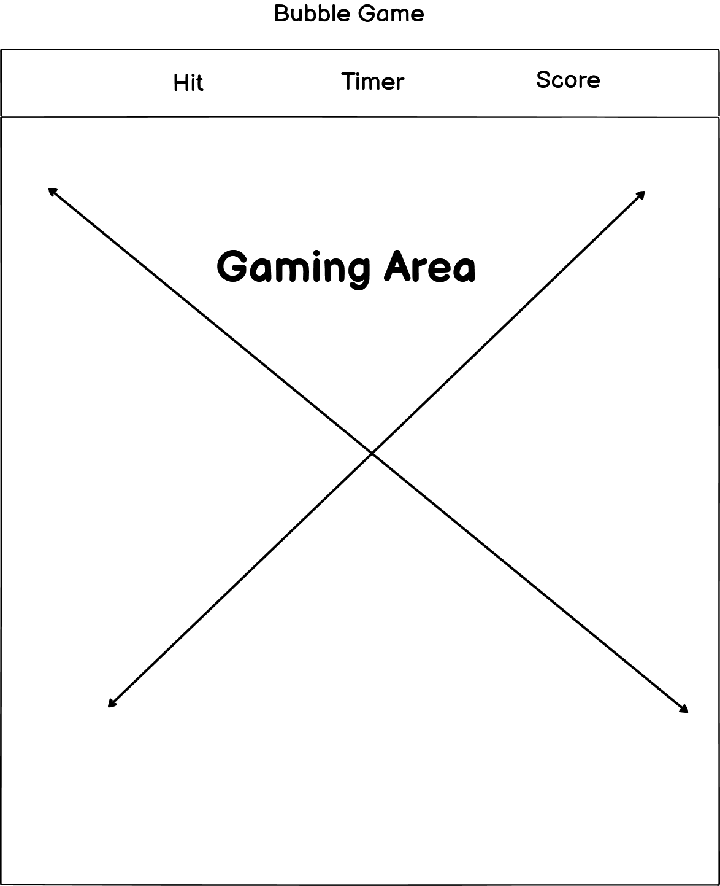

# [BUBBLE GAME](https://shugu19.github.io/Bubble-Game)

[](https://github.com/Shugu19/Bubble-Game/commits/main)
[](https://github.com/Shugu19/Bubble-Game/commits/main)
[](https://github.com/Shugu19/Bubble-Game)

# Bubble Game

## Overview
Bubble Game is an engaging and fun web-based game where players pop bubbles with matching numbers to earn points. The game is designed to be challenging yet entertaining, providing users with a countdown timer to add an element of urgency. This game aims to offer a simple yet addictive experience suitable for all ages.

## Features
- **Hit Target**: Displays the number you need to match by clicking on the bubbles.
- **Timer**: A countdown timer that gives you a limited amount of time to score as many points as possible.
- **Score**: Keeps track of your current score.
- **Responsive Design**: Works well on various screen sizes, from desktops to mobile devices.
- **Restart Button**: Allows players to restart the game at any time.

## How to Play
1. Click the "Start Game" button to begin.
2. A random number will appear in the "Hit" box.
3. Click on bubbles that match the number in the "Hit" box to earn points.
4. Each correct bubble click increases your score by 10 points.
5. The game ends when the timer reaches zero.
6. You can restart the game at any time by clicking the restart button.

## Development
This game was built using HTML, CSS, and JavaScript. It uses responsive design principles to ensure a great user experience on all devices. The game dynamically generates bubbles and updates the score, timer, and hit number in real-time.

## Screenshots
Here is a mockup of how the game looks on different devices:


source: [amiresponsive](https://ui.dev/amiresponsive?url=https://shugu19.github.io/Bubble-Game)

## Installation
1. Clone the repository:
    ```sh
    git clone (https://shugu19.github.io/Bubble-Game)
    ```
2. Navigate to the project directory:
    ```sh
    cd bubble-game
    ```
3. Open `index.html` in your preferred web browser.

## Usage
Click the "Start Game" button to begin playing. Match the numbers and keep an eye on the timer. Click the restart button to play again.

## Credits
- **Developer**: Shubham Badhan

## UX
The design process focused on creating an intuitive and visually engaging interface. The colors were chosen to ensure readability and to create a sense of excitement and urgency. The layout is responsive, ensuring a seamless experience across different devices.

### Colour Scheme

- `#ffffff` used for primary text.
- `#085784` used for primary highlights.
- `#063251f0` used for secondary highlights.


I've used CSS `:root` variables to easily update the global colour scheme by changing only one value, instead of everywhere in the CSS file.

```css
:root {
  --text-color: #ffffff;
  --highlight-color: #085784;
  --secondary-highlight-color: #063251f0;
}
```

### Typography

- [Montserrat](https://fonts.google.com/specimen/Montserrat) was used for the primary headers and titles.

## Wireframes

I've used [Balsamiq](https://balsamiq.com/wireframes) to design my site wireframes.

### Mobile Wireframes

< details >
< summary > Click here to see the Mobile Wireframes < / summary >

Home
  - 

GamingArea
  - 

< / details >

### Tablet Wireframes

< details >
< summary > Click here to see the Tablet Wireframes < / summary >

Home
  - 

GamingArea
  - 
< / details >

### Desktop Wireframes

< details >
< summary > Click here to see the Desktop Wireframes < / summary >

Home
  - 

GamingArea
  - 

< / details >

## Tools & Technologies Used

- [](https://tim.2bn.dev/markdown-builder) used to generate README and TESTING templates.
- [](https://git-scm.com) used for version control. (`git add`, `git commit`, `git push`)
- [](https://github.com) used for secure online code storage.
- [](https://code.visualstudio.com) used as my local IDE for development.
- [](https://en.wikipedia.org/wiki/HTML) used for the main site content.
- [](https://en.wikipedia.org/wiki/CSS) used for the main site design and layout.
- [](https://www.javascript.com) used for user interaction on the site.
- [](https://pages.github.com) used for hosting the deployed front-end site.
- [](https://chat.openai.com) used to help debug, troubleshoot, and explain things.

## Testing

> [!NOTE]  
> For all testing, please refer to the [TESTING.md](TESTING.md) file.

## Deployment

The site was deployed to GitHub Pages. The steps to deploy are as follows:

- In the [GitHub repository](https://github.com/Shugu19/Bubble-Game), navigate to the Settings tab 
- From the source section drop-down menu, select the **Main** Branch, then click "Save".
- The page will be automatically refreshed with a detailed ribbon display to indicate the successful deployment.

The live link can be found [here](https://shugu19.github.io/Bubble-Game)

### Local Deployment

This project can be cloned or forked in order to make a local copy on your own system.

#### Cloning

You can clone the repository by following these steps:

1. Go to the [GitHub repository](https://github.com/Shugu19/Bubble-Game) 
2. Locate the Code button above the list of files and click it 
3. Select if you prefer to clone using HTTPS, SSH, or GitHub CLI and click the copy button to copy the URL to your clipboard
4. Open Git Bash or Terminal
5. Change the current working directory to the one where you want the cloned directory
6. In your IDE Terminal, type the following command to clone my repository:
	- `git clone https://github.com/Shugu19/Bubble-Game.git`
7. Press Enter to create your local clone.

Alternatively, if using Gitpod, you can click below to create your own workspace using this repository.

[](https://gitpod.io/#https://github.com/Shugu19/Bubble-Game)

Please note that in order to directly open the project in Gitpod, you need to have the browser extension installed.
A tutorial on how to do that can be found [here](https://www.gitpod.io/docs/configure/user-settings/browser-extension).

#### Forking

By forking the GitHub Repository, we make a copy of the original repository on our GitHub account to view and/or make changes without affecting the original owner's repository.
You can fork this repository by using the following steps:

1. Log in to GitHub and locate the [GitHub Repository](https://github.com/Shugu19/Bubble-Game)
2. At the top of the Repository (not top of page) just above the "Settings" Button on the menu, locate the "Fork" Button.
3. Once clicked, you should now have a copy of the original repository in your own GitHub account!


## Credits

| Source | Location | Notes |
| --- | --- | --- |
| [Markdown Builder](https://tim.2bn.dev/markdown-builder) | README and TESTING | tool to help generate the Markdown files |
| [YouTube](https://www.youtube.com/watch?v=YL1F4dCUlLc) | leaderboard | using `localStorage()` in JS for high scores |


### Acknowledgements

- I would like to thank my Code Institute mentor, [Tim Nelson](https://github.com/TravelTimN) for his support throughout the development of this project.
- I would like to thank the [Code Institute](https://codeinstitute.net) tutor team for their assistance with troubleshooting and debugging some project issues.
- I would like to thank the [Code Institute Slack community](https://code-institute-room.slack.com) for the moral support; it kept me going during periods of self doubt and imposter syndrome.
