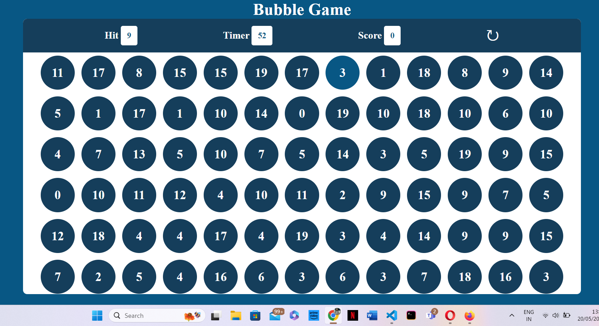
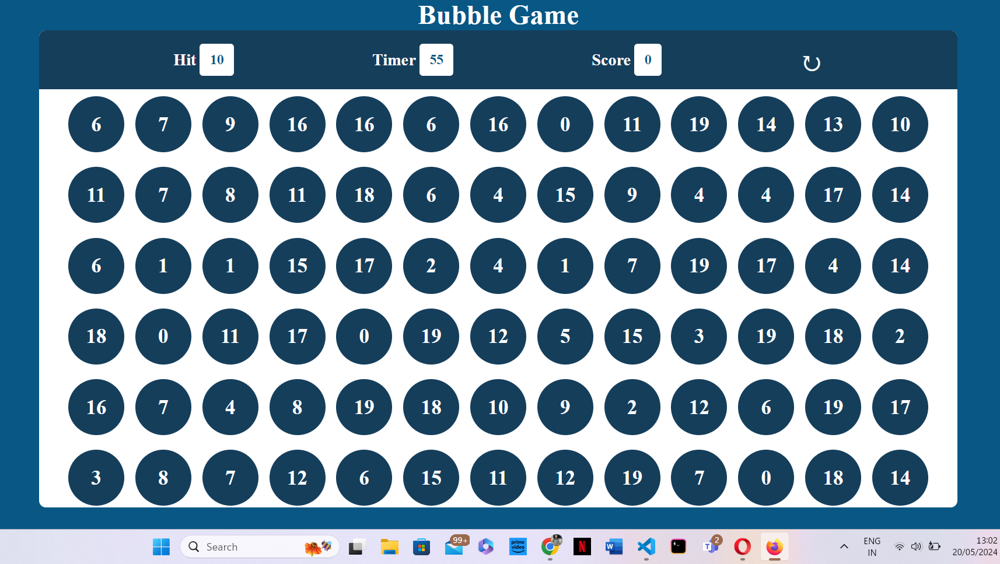
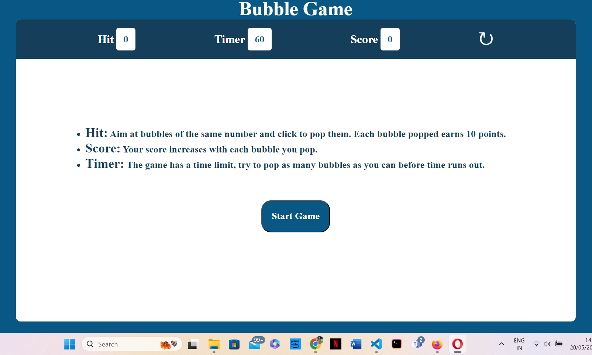
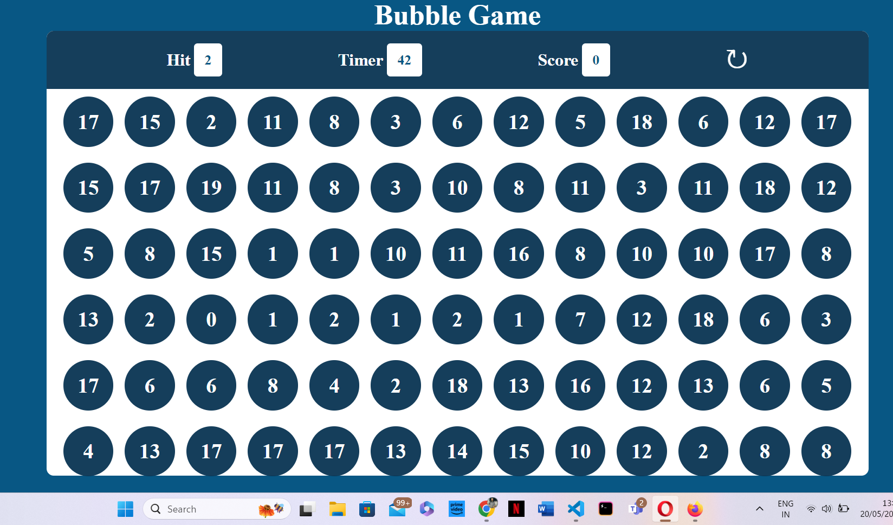
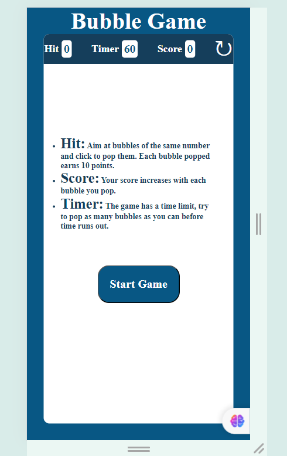
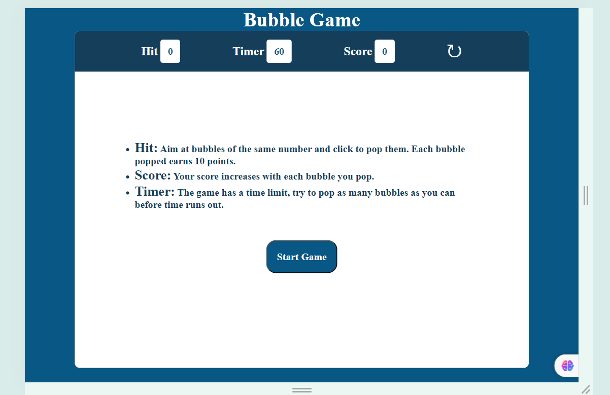
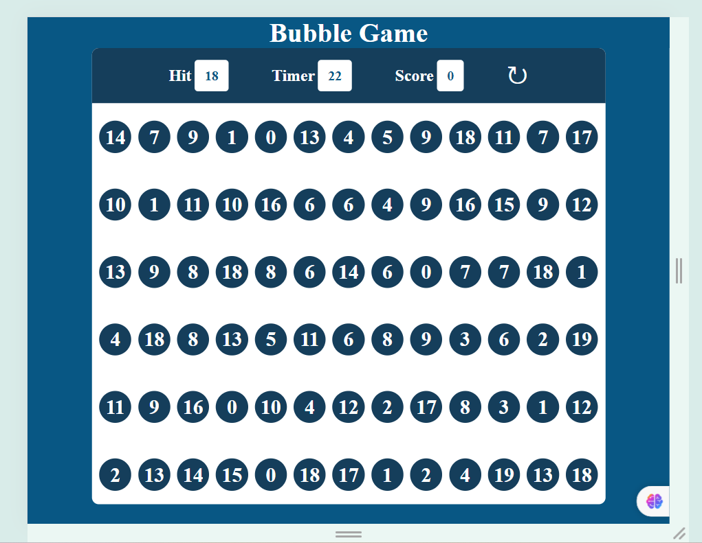
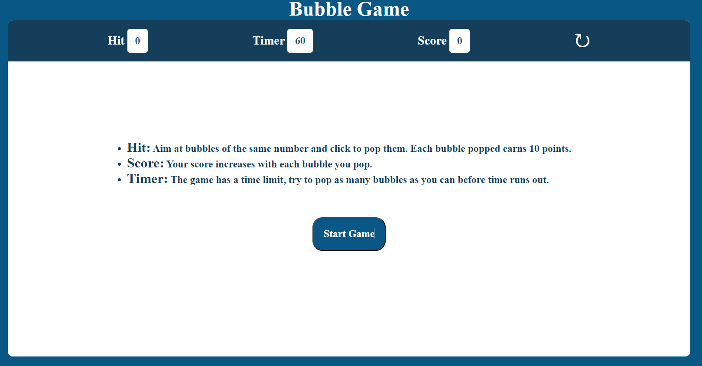

# Testing

> [!NOTE]  
> Return back to the [README.md](README.md) file.

## Code Validation

### HTML

I have used the recommended [HTML W3C Validator](https://validator.w3.org) to validate all of my HTML files.

| Directory | File       | Screenshot                                                                   | Notes |
| --------- | ---------- | ---------------------------------------------------------------------------- | ----- |
|           | index.html |  |       |

### CSS

I have used the recommended [CSS Jigsaw Validator](https://jigsaw.w3.org/css-validator) to validate all of my CSS files.

| Directory | File      | Screenshot                                                                   | Notes |
| --------- | --------- | ---------------------------------------------------------------------------- | ----- |
| assets    | style.css |  |       |

### JavaScript

I have used the recommended [JShint Validator](https://jshint.com) to validate all of my JS files.

| Directory | File      | Screenshot                                                                   | Notes |
| --------- | --------- | ---------------------------------------------------------------------------- | ----- |
| assets    | script.js |  |       |

## Browser Compatibility

Recommended browsers to consider:

- [Chrome](https://www.google.com/chrome)
- [Firefox (Developer Edition)](https://www.mozilla.org/firefox/developer)
- [Opera](https://www.opera.com/download)

I've tested my deployed project on multiple browsers to check for compatibility issues.

| Browser | Home  | Gaming Area | Notes |
| ------- | ------| ------------| ----- | 
| Chrome  |   |   | Works as expected |
| Firefox |  |  |Works as expected |
| Opera   |  |   | Works as expected |

## Responsiveness

I've tested my deployed project on multiple devices to check for responsiveness issues.

| Device |Home      |GamingArea      | Notes |
| -------| -------- | ----------------- |-------|
| Mobile (DevTools) |   | | Works as expected |
| Tablet (DevTools) |  |  | Works as expected |
| Desktop           |  |  | Works as expected |
| iPhone 14 pro max |  |  | Works as expected |

## Lighthouse Audit

I've tested my deployed project using the Lighthouse Audit tool to check for any major issues.

| Page | Home | Notes |
| -----| -----| ----  |
| Mobile|  |  Some minor warnings |
| Desktop | | Some minor warnings |

## Bugs

- JS Uncaught ReferenceError: `hit` is undefined/not defined

  

  - To fix this, I JS Bubble Game: Non-Matchable Bubble Bug

    To fix this, I ensured that the hit number is always included in the generated bubbles. The steps taken to fix this were:

    Modified the makeNewBubble function to create an array of bubble numbers.
    Checked if the hit number is present in the array.
    If the hit number was not present, replaced a random index in the array with the hit number.
    Constructed the bubble elements from the modified array to ensure the hit number was always included.

- JS `'let'` or `'const'` or `'template literal syntax'` or `'arrow function syntax (=>)'` is available in ES6 (use `'esversion: 11'`) or Mozilla JS extensions (use moz).

  - To fix this, I added /* jshint esversion: 6 */ at the top of the JavaScript file to specify that the code is using ES6 features.

If you legitimately cannot find any unfixed bugs or warnings, then use the following sentence:

> [!NOTE]  
> There are no remaining bugs that I am aware of.
